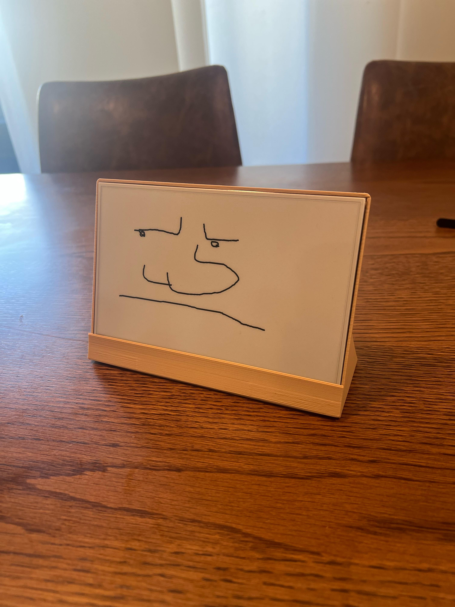
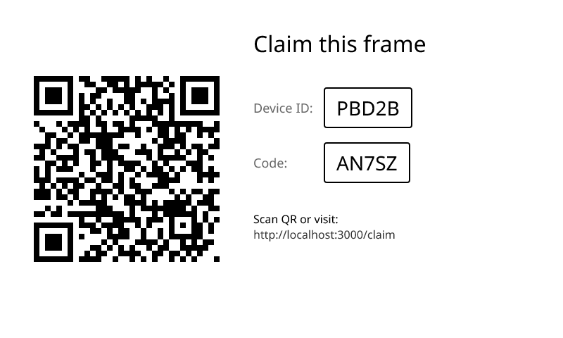

# Ditto



Share doodles with your friends with e-ink hardware!

Currently compatible with TRMNL firmware, but more firmware support can be added by request.

> [!IMPORTANT]
> This project should be treated like an early alpha.
> Until v1.0.0, please check minor version bumps for breaking changes!

This repo is a work-in-progress while I transition it for broader use.
It's still a prototype!
If anything is getting in your way, please voice it in the issues tab.

Contributions welcome!

## Features

- Shared drawing canvases frontend with not-quite-real-time sync
- Configurable device polling rates. Defaults to every 10 minutes
- Canvas albums for multi-canvas organization
- Device-to-user registration

## Setup

### Prerequisites

- Node.js 22+
- pnpm
- optional: just

Alternatively, a Nix flake is included to bundle the pre-reqs for you if you're into that.

### Environment

To start local development copy the env example files:

```sh
cp server/.env.example server/.env.local
cp server/.env.turso.example server/.env.turso
```

All environment variables will need to be filled out for a production build.
This includes an unfortunate required dependency on WorkOS for auth.
Fixing this is high on the list of to-dos.
Feel free to fork!

### Development

```sh
cd server
pnpm install
# initialize local sqlite file
pnpm db:push
# start server at localhost:3000
pnpm dev
```

Run tests with:

```sh
cd server
pnpm test
```

Generate schema migrations with:

```sh
cd server
pnpm db:generate
```

### Production Builds

Currently this project is tied pretty closely to its service providers:

- Cloudflare R2
- Turso
- Vercel
- WorkOS

If you want to do your builds yourself, the important commands are:

```sh
cd server
pnpm install
pnpm build
```

Make schema changes to your prod db by sourcing server/.env.turso then either:

run the migration steps

```sh
pnpm db:migrate
```

or push your schema changes directly

```sh
pnpm db:push
```

## Frame Setup Guide

1. Point the device firmware at your server instance
   - on TRMNL devices, this may need reflashing. See the [TRMNL Firmware Repo](https://github.com/usetrmnl/trmnl-firmware) and [TRMNL BYOD Wiki page](https://docs.trmnl.com/go/diy/byod) for instructions.
2. Your device should display a claim screen (see image below)
3. Scan the QR code or navigate to the provided URL
4. Log in or sign up, then fill in the ID and code on the frame
5. Your device should now be registered. It might need a restart to refresh the screen



## Configuration

This server was originally built to doodle between two [Seeed Studio TRMNL 7.5" DIY Kits](https://www.seeedstudio.com/TRMNL-7-5-Inch-OG-DIY-Kit-p-6481.html).
If your devices are different, you might need to adjust values in `server/lib/config.ts`.

If you find a specific device does or doesn't work with the config values available, please open an issue!

## Roadmap

- Dockerfile and external dependency decoupling (auth, r2, db provider)
- Support for multiple devices of different sizes
- Album gallery mode

## License

Apache 2.0
